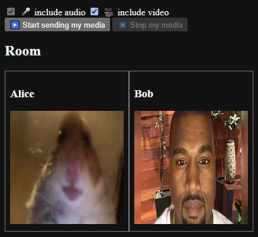

# video-call-over-email

<!-- Yep, actual video call over actual email. -->

A [webxdc](https://webxdc.org) app for actual video calls over actual email (albeit with 15-second ping (but [it may improve soon](https://github.com/deltachat/deltachat-core-rust/pull/4904))).
Update 2025-06: the ratelimit got decreased down to 1 email per second for Chatmail servers (nine.testrun.org), so now one-way delay is ~3 seconds (and the ping is ~6 seconds)!

Also see the [fork, "A webxdc app for P2P real-time video calls"](https://github.com/WofWca/webxdc-video-call) (which is _not_ email-based).



This is just a prototype.

## Usage

As was said, this is a [webxdc](https://webxdc.org) app. It requires a webxdc-supporting messenger to run. Delta Chat is one such messenger.

However, as of 2023-11-16, sending audio/video won't work on unmodified versions of Delta Chat, but [this may change](https://support.delta.chat/t/allow-access-to-camera-geolocation-other-web-apis/2446?u=wofwca) in the near future.

_Receiving_ video _does_ work on regular Delta Chat,
so you can play around with the app
without having to convince your friends to modify their Delta Chat.

### Modifying Delta Chat

Below are instructions on how to modify Delta Chat. But make sure **not to launch any webxdc apps** that you don't trust on the modified version of Delta Chat as it is **insecure**. These instructions were tested on Delta Chat 1.58.0.

1. Download [Delta Chat Desktop](https://delta.chat/).
2. Find the `DeltaChat/resources/app.asar` file in the app folder.
3. Create a backup copy of the `app.asar` file.
3. Open the original `app.asar` file as a ZIP file.
4. Open the `bundle_out/index.js` file inside the archive.
5. Find and replace

   ```javascript
   ["pointerLock", "fullscreen"]
   ```

   with

   ```javascript
   [/* ADDED BY ME */ "media", "pointerLock", "fullscreen"]
   ```

6. Save the modified app.asar file.
7. After you're done playing around with this app, replace the modified `app.asar` file with the backup copy you made, or simply reinstall Delta Chat.

### Running the app

1. Launch Delta Chat.
2. Build an `.xdc` file with `./create-xdc.sh`, or just [download it from the "Releases" section](https://github.com/WofWca/video-call-over-email/releases/latest/download/webxdc-video-call.xdc).
3. Send the `.xdc` file to a chat.
4. Wait for some other chat members to launch the app.
5. Press "Start sending my media"; or just wait for others to send theirs.

Keep in mind that video data takes a lot of space. Make sure not to waste the storage quota on your email server. The expected bitrate in this app for audio + video is ~50 MB / hour per member and ~2 MB / hour per member for just audio.

## Why

Because it's funny.

And it might actually become an actually useful video call app, when:

- [x] [the ratelimit](https://github.com/deltachat/deltachat-core-rust/blob/212751f173139aab3daadcd77388b3551004cabe/src/context.rs#L382) gets much better than 1 email per 10 seconds
      Update 2025-06: the ratelimit got decreased down to 1 email per second for Chatmail servers (nine.testrun.org), so now one-way delay is ~3 seconds!
- webxdc apps can be [allowed camera permission](https://support.delta.chat/t/allow-access-to-camera-geolocation-other-web-apis/2446?u=wofwca)
- A way is found to not fill up email servers with audio/video data (maybe something like "ephemeral webxdc messages")

## How it works

Nope, it's not WebRTC.

1. Record 10 seconds of your camera stream with a [`MediaRecorder`](https://developer.mozilla.org/en-US/docs/Web/API/MediaStream_Recording_API).
2. Serialize the data.
3. Send it over email (with [`webxdc.sendUpdate()`](https://docs.webxdc.org/spec/sendUpdate.html)).
4. Repeat from step 1.

When we receive data, deserialize it and display it using [Media Source Extensions API](https://developer.mozilla.org/en-US/docs/Web/API/Media_Source_Extensions_API).

## Web demo (no email involved)

If you just want to see how the app feels, without actually using email, go to <https://wofwca.github.io/video-call-over-email/> .
